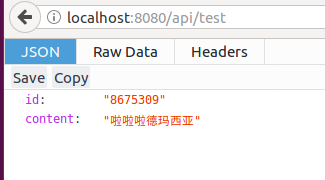
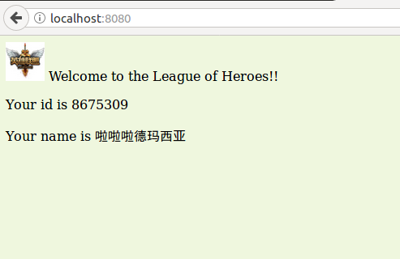

#### 处理web程序的输入与输出
##### 1.概述
设计一个web小应用,展示静态文件服务、js请求支持、磨板输出、表单处理、Filter中间件设计等方面的能力(不需要数据库支持)
##### 2.任务
编程web应用程序cloudgo-io  
1.支持静态文件服务、js请求支持  
路由设置:  
  
html:  
  
设置api/test的路由  
  
设置对应的handler  
  
js:  
通过ajax访问localhost:8080/api/test,得到返回的json数据.再给网页添加获取到的数据  
  
网页显示  
  
  
  
2.添加静态文件访问路径独立前缀  
路由设置:  
  
网页显示  
  
  
3.模板输出  
设置模板文件,定义扩展项  
  
路由设置:  
  
定义handler:  
  
定义模板:  
  
网页显示:  

4.表单处理  
(1)提交表单页面  
路由设置:  
  
定义handler:  
  
定义模板:  
  
网页显示:  
  
(2)提交表单并输出表格  
路由设置:  

定义handler:  
  
定义模板:  
  
网页显示:  
  
  
5.对/unknown给出开发中的提示,返回码5xx
网页显示:  

